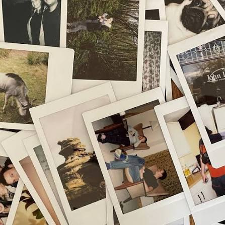
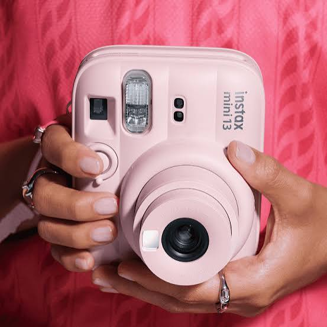
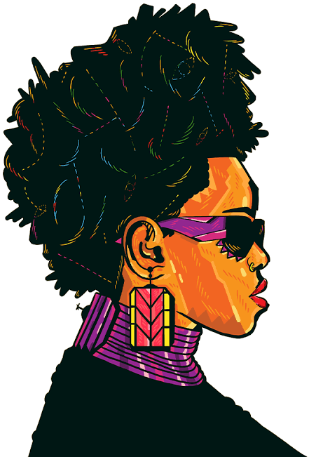
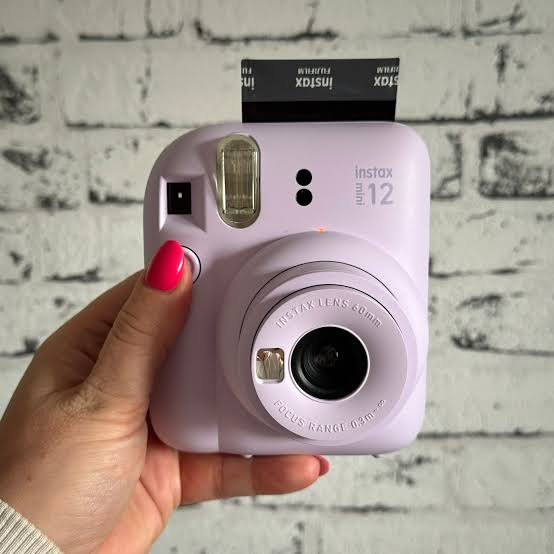
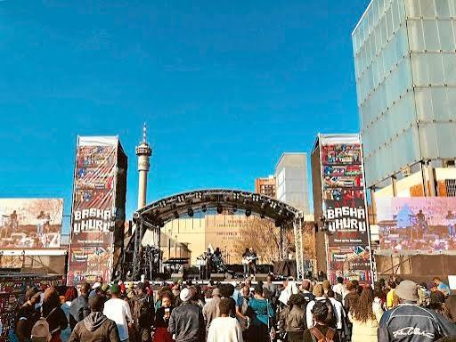

<!DOCTYPE html>
<html lang="en">
<head>
  <meta charset="UTF-8">
  <meta name="viewport" content="width=device-width, initial-scale=1.0">
  <title>Instax × Basha Uhuru 2026 — Pitch Deck</title>
  <link href="https://fonts.googleapis.com/css2?family=DM+Serif+Display:ital@0;1&family=DM+Sans:wght@400;500;700&display=swap" rel="stylesheet">
  
</head>
<body>
  <section class="hero">
    
    

      
FUJIFILM instax×BASHA UHURU 2026

      

    

    

      

      <h1 class="hero-title">The Festival Archive</h1>
      

      
Freezing youth culture and creative expression live on the historic stones of Constitution Hill.

      
An experiential, content-led partnership proposal — 14th edition

      

Live Proposal

Impacta Marketing

June 2026

    

    
Scroll

  </section>
  

  <section class="section section-light">
    

      

        
● The Platform

        <h2 class="section-title">Unlocking the Flagship</h2>
        

      

      

        

          
<strong style="color:var(--basha-orange);">Timeline:</strong> 25 – 27 June 2026 <strong style="color:var(--basha-orange);">Venue:</strong> Constitution Hill, Johannesburg

          
This landmark run commemorates the <strong>50th Anniversary of the Youth Uprising</strong>. We activate directly inside Constitution Hill. We establish emotional connection first, then pipeline to commercial activations.

          

"We establish the emotional connection here first, setting up a perfect pipeline for commercial mall activations later."

        

        

          

Day 01<h4>Creative Conference</h4>
Masterclasses and digital designer panels with industry leaders.

          

Day 02<h4>Curated Makers Market</h4>
Direct touchpoints with alternative creative brands and artisans.

          

Day 03<h4>Freedom Soundstage</h4>
<strong>7,000+</strong> fashion-forward, energetic spectators live.

        

      

    

  </section>
  

  <section class="section section-alt">
    

      

        
● Footprint Metrics

        <h2 class="section-title">High Impact Human Traffic</h2>
        

        
Direct product-in-hand exposure with active South African lifestyle architects, creators, and cultural innovators.

      

      

        

7,400+

Ticketed Festival Attendees

        

18-35

Core Creator Age Demo

        

675+

On-Site Media & Specialists

        

172+

Makers Market Small Businesses

      

      
<h3 style="font-size:1.1rem; margin-bottom:1.5rem; color:var(--basha-orange);">Audience Composition</h3>
        

Creators & Influencers42%

        

Fashion & Style Enthusiasts28%

        

Music & Arts Collectors18%

        

Press, Media & VIPs12%

      

    

  </section>
  

  <section class="section section-light">
    

      

        
● Sponsorship

        <h2 class="section-title">Ecosystem Integration</h2>
        

      

      

        

Massive macro-media campaign reach. The festival operates an intensive <strong style="color:var(--basha-orange);">2-Month Media Runway</strong> generating exceptional brand visibility.

          
<h4 style="font-size:0.95rem; margin-bottom:1rem; text-transform:uppercase; letter-spacing:1px; opacity:0.5;">Media Reach Distribution</h4>
            

6.98MTotal Reach

              

                

Digital & Social (46%)

                

Radio & Broadcast (38%)

                

Print & OOH (13%)

                

Other (3%)

              

            

          

          

92%

Positive Brand Sentiment

Across all tracked national channels

        

        

          

Headline Sponsor

Complete festival platform presence

Tier 1

          

Supporting Partner

Immersive experiential execution & photo hubs

✓ Fit

          

Program Sponsor

Creative conference workshop co-presentation

Tier 3

        

      

    

  </section>
  

  <section class="section section-alt">
    

      

        
● Deliverable Track

        <h2 class="section-title">Strategic Value Delivery</h2>
        

        
Converting collaborative brand equity into long-term cultural alignment.

      

      

        

<h4>Structural Presence</h4>
Premium custom interactive experiential photo zones with full brand immersion.

        

<h4>Content Dominance</h4>
Logo placement on all digital assets, video highlights, and PR rollouts for maximum visibility.

        

<h4>Direct Sampling</h4>
Premium bundling inside official artist, press, and VIP gift packs for tactile brand experience.

        

<h4>Hospitality Suite</h4>
Assigned allocations for live performance arenas and executive networking lounges.

      

    

  </section>
  

  <section class="section section-dark">
    

      

        
● Blueprint

        <h2 class="section-title">The Blueprint: The Archive Hub</h2>
        

        
Turning attendees into dynamic curators of history. We make the camera feel essential to creative preservation.

      

      

        

By highlighting self-expression at Constitution Hill, we build the ultimate brand foundation to launch upcoming commercial pushes with maximum cultural backing.

          

CULTURE '26

        

        

          

            
1

            

              <h4>The Living Archive Installation</h4>
              
A striking physical structure in the central courtyard where attendees pin their live street style Instax snaps, building an interactive art mosaic.

            

          

          

            
2

            

              <h4>Masterclass Creative Roamers</h4>
              
Equipping design student leaders with Instax setups during June 26 conference panels to log instant behind-the-scenes portfolios.

            

          

          

            
3

            

              <h4>Soundstage Lookbook Zones</h4>
              
Vibrant photo framing installations at the main concert gates to tag incoming alternative fashion looks in real time.

            

          

        

      

    

  </section>
  <footer class="deck-footer">
    

      
FUJIFILM instax×BASHA UHURU 2026

      

      
Impacta Marketing Partner Strategy | June 2026

    

  </footer>
</body>
</html>
